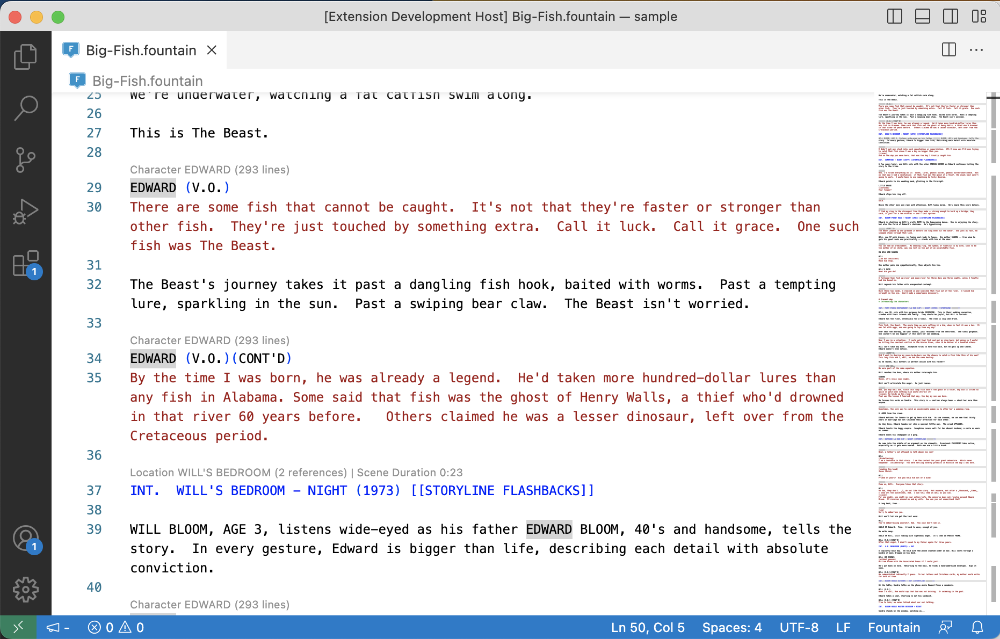
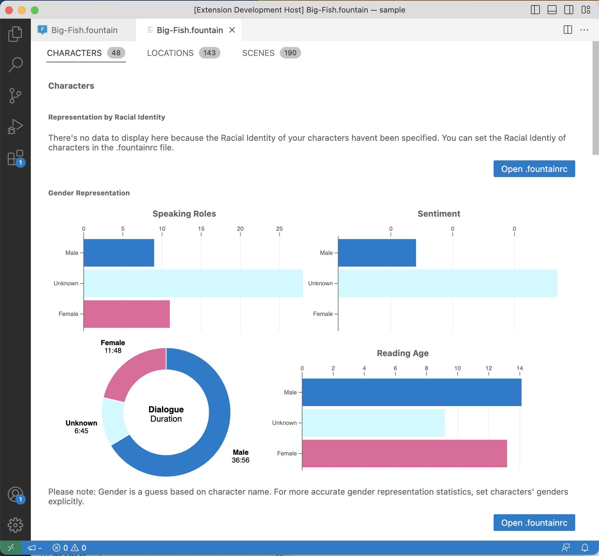
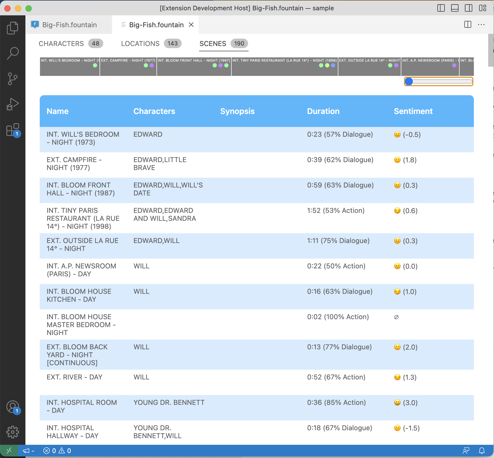

#  Fountain Language Server and Client

This extension provides Language Server support for [fountain](https://fountain.io/) files, a simple markup syntax for writing, editing, and sharing screenplays in plain, human-readable text. With this extension, you can work on your screenplay anywhere, on any computer or tablet, using any text editor.

## Features

- [x] Full Syntax highlighting
- [x] Smart Auto-Completions
- [x] Fountain Syntax help on Hover
- [x] Screenplay Statistics Webview

### Roadmap

The long-term goal of this project is to enable interactive and serialized productions, with worldbuilding elements, by helping to navigate and explore characters, locations, etc as well as interralationships between elements in the narrative with minimal additional overhead.

- [ ] Semantic Analysis
  - [ ] Summary page per character (Age, Racial Identity, Gender Identity, Profile Picture, Relationships)
  - [ ] Summary page per location (Location Details, Valence by Character, Concept Picture, Scene Frequency, Generate Shot list)
  - [ ] Graph valence over the duration of the screenplay, and over episodes
- [ ] Serialised & Interactive Workflows
  - [ ] Screenplay stats over the whole folder, and whole workspace
  - [ ] Support for Interactive elements and branching stories
- [ ] Storyboarding workflow
- [ ] Specify relationship between locations and characters, distance between locations

## Thanks / Third-party licenses

* Syntax highlighting thanks to a modified version of the .tmlanguage for [fountain-sublime-text](https://github.com/poritsky/fountain-sublime-text) by [Jonathan Poritsky](https://github.com/poritsky) (modified by [Piers Deseilligny](https://github.com/piersdeseilligny) for [betterfountain](https://github.com/piersdeseilligny/betterfountain))

* The statistics panel uses [d3](https://d3js.org/), covered by the [BSD-3-Clause License](https://github.com/d3/d3/blob/master/LICENSE).

* The project was built using Microsoft's language server example extension as a boilerplate.
